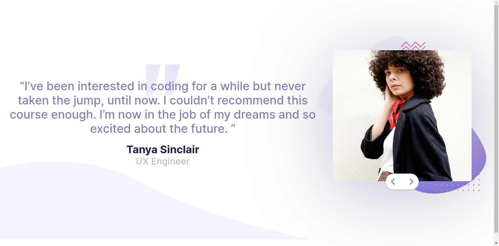

# Frontend Mentor - Coding bootcamp testimonials slider solution

This is a solution to the [Coding bootcamp testimonials slider challenge on Frontend Mentor](https://www.frontendmentor.io/challenges/coding-bootcamp-testimonials-slider-4FNyLA8JL). Frontend Mentor challenges help you improve your coding skills by building realistic projects. 

## Table of contents

- [Overview](#overview)
  - [The challenge](#the-challenge)
  - [Screenshot](#screenshot)
  - [Links](#links)
- [My process](#my-process)
  - [Built with](#built-with)
  - [What I learned](#what-i-learned)
  - [Continued development](#continued-development)
- [Author](#author)

## Overview

### The challenge

Users should be able to:

- View the optimal layout for the component depending on their device's screen size
- Navigate the slider using either their mouse/trackpad or keyboard

### Screenshot

### Links

- Solution URL: [https://github.com/Raymacmillan/Bootcamp-Testimonials-Slider/](https://github.com/Raymacmillan/Bootcamp-Testimonials-Slider/)
- Live Site URL: [https://raymacmillan.github.io/Bootcamp-Testimonials-Slider/](https://raymacmillan.github.io/Bootcamp-Testimonials-Slider/)

## My process

### Built with

- Semantic HTML5 markup
- Flexbox
- Mobile-first workflow

### What I learned

I lear'nt about animations and transitions in CSS which was extremely useful in making my project more user friendly

### Continued development

I want to start focusing on learning more event listeners and learning how to make my code more shorter and avoid unecessary code.I also want to learn SASS in the future.

## Author

- Frontend Mentor - [@Raymacmillan](https://www.frontendmentor.io/profile/Raymacmillan)
- Twitter - [@RyoGenex](https://www.twitter.com/RyoGenex)
